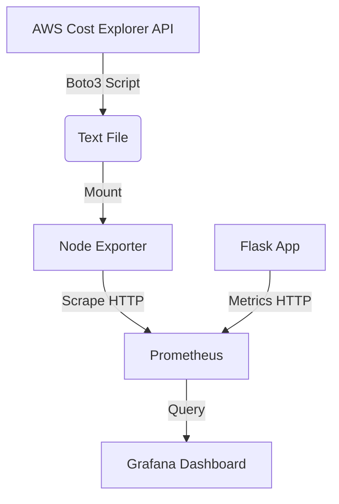

# Senior DevOps Portfolio

**Cloud Engineering | FinOps | SRE**

**Author:** Adrian Anthony Denis
**Focus:** Solving complex infrastructure challenges with automation, observability, and security.

---

## 📂 Engineering Projects
This monorepo documents my journey building production-grade DevOps systems.

| Project | Role | Tech Stack | Key Achievement |
| :--- | :--- | :--- | :--- |
| [**1. FinOps Observability Pipeline**](./project-1-finops) | Cloud Engineer | Python, AWS Cost Explorer, Prometheus, Grafana | correlated AWS spend with system latency in real-time. |
| [**2. High-Availability Cluster**](./project-2-ha-cluster) | SRE | Docker Swarm, HAProxy, PostgreSQL, Secrets | Designed a self-healing DB architecture with 99.9% uptime and zero-trust security. |
| **3. Coming Soon...** | DevSecOps | Kubernetes (K8s), ArgoCD, Vault | *Currently under active development.* |

---

## 🛠️ Technical Skills

* **Infrastructure:** Docker Swarm, Terraform, AWS (EC2, IAM, Cost Explorer).
* **Observability:** Prometheus, Grafana, AlertManager.
* **Scripting:** Python (Boto3, Flask), Bash.
* **Security:** Docker Secrets, Least Privilege IAM, Image Signing (SHA256).

---

## 📫 Contact
* **GitHub:** [github.com/adriandenisofficial](https://github.com/adriandenisofficial)
* **Email:** [Your Email Here]
* **LinkedIn:** [Your LinkedIn Here]

# Senior DevOps Portfolio
### Cloud Engineering | FinOps | SRE

**Author:** Adrian Anthony Denis

**Focus:** Solving complex infrastructure challenges with automation, observability, and security.

---

## 📂 Repository Structure
This monorepo documents my journey building production-grade DevOps systems.

- **[Project 1: FinOps Observability Pipeline](./project-1-finops)** - *Bridging the gap between Engineering, Finance, and Business metrics.*

---

## 🚀 Project 1: FinOps Observability Pipeline
### The Challenge
In modern cloud environments, engineering teams often lack visibility into the financial impact of their infrastructure. "Cost" is usually a bill at the end of the month, not a metric in the dashboard.

### The Solution
I built a full-stack observability pipeline that correlates **System Health** (Latency), **Business Growth** (Revenue), and **Cloud Costs** (AWS Spend) in a single pane of glass. This allows teams to make data-driven decisions about scaling and pricing.

### 🛠 Tech Stack
- **Infrastructure:** Docker & Docker Compose
- **Application:** Python (Flask) with custom Prometheus instrumentation
- **Observability:** Prometheus, Grafana, Node Exporter
- **Cloud Integration:** AWS Boto3 SDK (Cost Explorer API)
- **Security:** IAM Roles & Least Privilege (No hardcoded keys)

### 🌟 Key Technical Implementations
1.  **Custom Prometheus Exporter:** Wrote a Python script to query the AWS Cost Explorer API and expose metrics via a textfile collector.
2.  **The Sidecar Pattern:** Utilized `node-exporter` as a sidecar to ingest the custom cost metrics without modifying the core Prometheus image.
3.  **Business Logic Monitoring:** Instrumented the Flask app to track "Revenue Per Second" alongside standard HTTP latency.

### 📸 Architecture & Evidence


*(Screenshots of the Grafana Dashboard showing Revenue, Latency, and Cost side-by-side)*
> **[Link to Dashboard Screenshot](./docs/final-dashboard-evidence.png)**

### 💻 How to Run This Project

**Prerequisites:**
* Docker & Docker Compose installed.
* **AWS Credentials:** The Python script requires AWS access. Ensure you have `~/.aws/credentials` set up or are running on an EC2 instance with an IAM Role.

**Steps:**
1.  **Clone the repo**
    ```bash
    git clone [https://github.com/adriandenisofficial/senior-devops-portfolio.git](https://github.com/adriandenisofficial/senior-devops-portfolio.git)
    cd senior-devops-portfolio/project-1-finops
    ```

2.  **Set Permissions (Crucial)**
    * *Linux/Mac only: Allow Docker to read the metrics folder.*
    ```bash
    chmod -R 777 prom_metrics
    ```

3.  **Build and Start**
    ```bash
    docker-compose up -d --build
    ```

4.  **Access the Dashboard**
    * Grafana: http://localhost:3000 (Login: admin/admin)
    * *Note: If running on EC2/Cloud, replace 'localhost' with your Public IP.*
